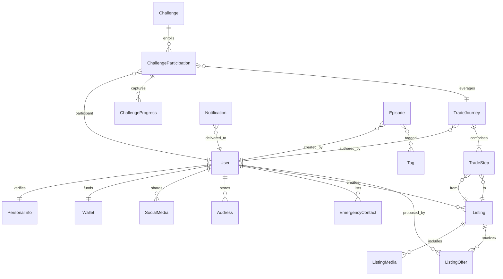
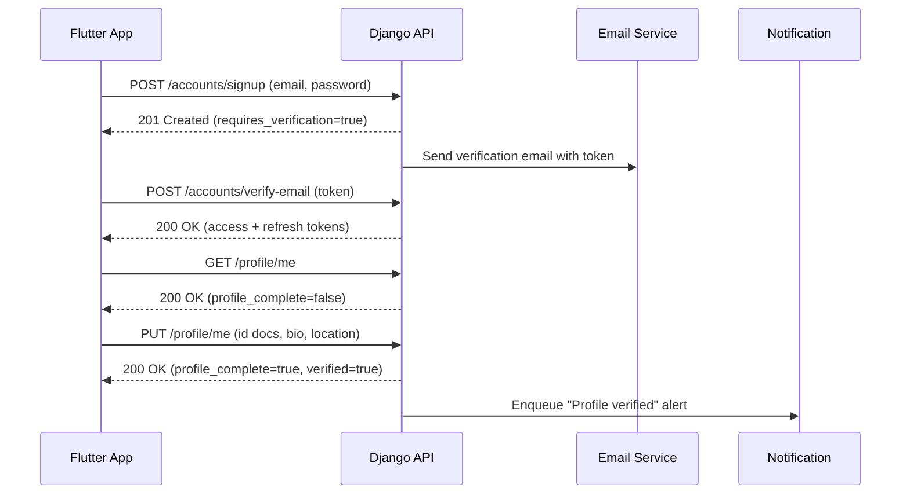
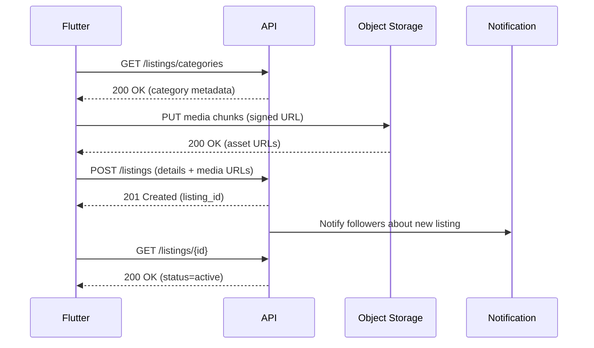
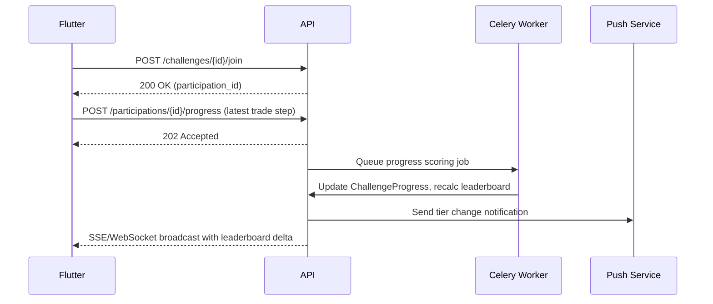

# SwapWing Domain Model & Flow Diagrams

This document captures the shared vocabulary for SwapWing's barter marketplace and community platform. It highlights the core entities the Django backend will persist and the Flutter client will consume, alongside key interaction flows that rely on those entities.

## Core Domain Entities

| Entity | Purpose | Key Relationships |
| --- | --- | --- |
| **User** | Authenticated trader identity (email-first login). | Owns a `PersonalInfo` record, `Wallet`, addresses, and emergency contacts. Creates listings, journeys, and challenge updates. |
| **PersonalInfo** | Profile enrichment and verification data (government ID, avatar, bio, location). | One-to-one with `User`; status controls trust indicators in UI. |
| **Wallet** | Tracks balance, bonuses, and preferred currency for payouts or escrow. | One-to-one with `User`. |
| **SocialMedia** | Optional links that boost discoverability. | Many-to-one with `User`. |
| **Listing** | Primary marketplace item/service offered for swap. | Created by a `User`; has `ListingMedia`, can seed a `TradeJourney`, and accumulates offers/interests. |
| **ListingMedia** | Images or video attached to a listing. | Many-to-one with `Listing`. |
| **ListingOffer** | Counterparty offer referencing an existing listing. | Many-to-one with `Listing` and references a `User` as proposer; generates negotiation threads. |
| **TradeJourney** | Narrative arc that documents each successful trade-up. | Owned by a `User`; built from sequential `TradeStep` entries; can be linked to `ChallengeParticipation`. |
| **TradeStep** | Atomic trade in a journey showing value progression. | References both source and destination `Listing` records and attaches media/story notes. |
| **Challenge** | Time-bound community goal (e.g., "Trade a paperclip to a bike"). | Created by admins or sponsors; aggregates `ChallengeParticipation` and leaderboard data. |
| **ChallengeParticipation** | Enrollment state for a trader competing in a challenge. | Connects `User`, `Challenge`, and (optionally) an active `TradeJourney`; records progress snapshots. |
| **ChallengeProgress** | Periodic metrics snapshots and ranking deltas. | Many-to-one with `ChallengeParticipation`; emits notifications. |
| **Notification** | In-app alerts and push payloads. | Many-to-one with `User`; triggered by verification events, offers, journey updates, and challenge standings. |
| **Episode** | Serialized video/content drop used to showcase marquee journeys. | Created by content team (`User`), tagged for discovery, and sharable across the community. |

## Entity Relationship Diagram

### Notes
- `Address` and `EmergencyContact` are not yet implemented on the Flutter side but exist in Django; exposing them in the API enables richer trust surfaces later.
- `ListingOffer` and `ChallengeProgress` are upcoming backend additions. The Flutter app currently mocks negotiation threads and leaderboards; these models anchor the future API.
- `Episode` and `Tag` come from the existing `trade_up_league` and `tags` apps. They are optional for MVP but integral to the community storytelling vision.

## Key Interaction Flows

### 1. Email Verification & Profile Completion

**Responsibilities**
- The backend enforces that unverified accounts cannot hit protected endpoints until `/accounts/verify-email` succeeds.
- Flutter stores tokens securely (Keychain/Keystore) and prompts for missing profile information until `profile_complete` is true.

### 2. Listing Creation Through Publishing

**Responsibilities**
- Object storage uploads happen before listing submission to keep the API stateless; signed URLs expire quickly for security.
- Django validates trade criteria (category, desired outcomes) and persists `ListingMedia` records atomically with the listing.
- Once created, the backend emits a notification and enqueues analytics events for discovery tuning.

### 3. Challenge Progress & Leaderboard Updates

**Responsibilities**
- Progress submissions are lightweight (`202 Accepted`) so Flutter remains responsive; heavy scoring work happens asynchronously.
- Real-time standings use Django Channels (WebSockets) or Server-Sent Events to keep Flutter leaderboards current without manual refresh.
- Push notifications trigger when a participant enters/leaves key tiers (top 3/top 10), aligning with user story ACs.

## Future Considerations

1. **Schema Governance:** Capture migrations for the planned `Listing`, `TradeJourney`, and `Challenge` models early so Flutter mock data can align with real enums and field names.
2. **Versioned APIs:** As features evolve, maintain backwards-compatible changes (e.g., additive fields) and document them alongside this ERD.
3. **Analytics Layer:** Tie entity events (listing created, journey step published, challenge rank change) into a central event stream to unlock dashboards referenced in Epic D.

---
This document should evolve with the product. Update the ERD and sequence diagrams whenever new entities or flows emerge so both Flutter and Django teams remain aligned.
